# Web-App-DevOps-Project

Welcome to the Web App DevOps Project repo! This application allows you to efficiently manage and track orders for a potential business. It provides an intuitive user interface for viewing existing orders and adding new ones.

## Table of Contents

- [Features](#features)
- [Getting Started](#getting-started)
- [Technology Stack](#technology-stack)
- [Change Notes](#change-notes)
- [Contributors](#contributors)
- [License](#license)

## Features

- **Order List:** View a comprehensive list of orders including details like date UUID, user ID, card number, store code, product code, product quantity, order date, and shipping date.
  

- **Pagination:** Easily navigate through multiple pages of orders using the built-in pagination feature.
  

- **Add New Order:** Fill out a user-friendly form to add new orders to the system with necessary information.
  

- **Data Validation:** Ensure data accuracy and completeness with required fields, date restrictions, and card number validation.

## Getting Started

### Prerequisites

For the application to succesfully run, you need to install the following packages:

- flask (version 2.2.2)
- pyodbc (version 4.0.39)
- SQLAlchemy (version 2.0.21)
- werkzeug (version 2.2.3)

### Usage

To run the application, you simply need to run the `app.py` script in this repository. Once the application starts you should be able to access it locally at `http://127.0.0.1:5000`. Here you will be meet with the following two pages:

1. **Order List Page:** Navigate to the "Order List" page to view all existing orders. Use the pagination controls to navigate between pages.

2. **Add New Order Page:** Click on the "Add New Order" tab to access the order form. Complete all required fields and ensure that your entries meet the specified criteria.

## Technology Stack

- **Backend:** Flask is used to build the backend of the application, handling routing, data processing, and interactions with the database.

- **Frontend:** The user interface is designed using HTML, CSS, and JavaScript to ensure a smooth and intuitive user experience.

- **Database:** The application employs an Azure SQL Database as its database system to store order-related data.

## Change Notes

### Features

#### Delivery Date 
This feature flag can be used to help show when the package will be delivered. It adds a delivery date column to the database and adds mapping to it in the backend to allow data transfer to and from the server and client. As well as adding elements to the HTML to show to the user.

#### Docker Containerisation
Created a docker file to help containerize the python application so it can be shared with other.

##### Steps

  1. Selected base image from which the application will run and also has capability to run flask
  2. Created the working directory where the application will work from and allows for web applications
  3. Copy all files from working directory locally to the directory in the container
  4. Installed all python dependencies from requirements.txt, while copying the file to the working directory of the container.
  5. Exposed the ports for 5000 (tcp) for data packet transfer between web browser and the container.
  6. Command to run the application using CMD.

#### Terraform

##### Network Services

Adds three files to help build infrastructure for Azure. These files include variables, outputs and the main. The main file builds the virtual network and NSG (network security groups). The NSG has two rules to allow Kubernetes and SSH protocol access to the virtual network. 

##### AKS Cluster

Adds files required to set up Azure Kubernetes Service (AKS). These files reference
outputs from the networking module to allow for dynamic inputs. Using the main file
from the root project. This module set ups the node pool and the parameters to get
the cluster working.

##### Main

Adds main.tf file to add the required parameters to create the components which we
defined in the previous modules.

###### Creating the service principle

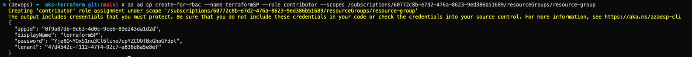

###### Inputs used

Used inputs:

- Networking:
  1. Resource Group: container to hold the related resources for the Azure solution specifically the AKS cluster
  2. Location: Where the resource group will be based or the servers
  3. Vnet address space: This is the IP address where all communication to and out of the resource group will go

- AKS Cluster
  1. Cluster name: this is the name of the cluster
  2. Cluster location: where the cluster will be located
  3. Dns prefix: This will have the dns-prefix of the cluster, so we can access it
  4. Kubernetes version: This is the version which the kubernetes version will run on
  5. Service principal client ID and secret: This will hold the necessary information for setting up the networking and aks cluster modules.

#### Kubernetes

##### Creating Deployment and Service Configurations

First created the kind of kubernetes service to be deployed, this included the name of the
application and the docker container to run the docker container. Used a rolling update 
strategy to release new versions of the applications by decommissioning one container for 
update and the other being used. Set minReadySeconds to 10 allow a newly created Pod 
should be ready without any of its containers crashing, for it to be considered available.

##### Testing application

Tested the application by create port forwarding on ports 5000 using TCP protocol for 
testing the website on local host. This allows us to open the website and then test 
functionality such as adding orders and viewing orders. 

##### Distribution of application without port forwarding

To distribute this application without port forwarding I would use ingress service to allow
access to the cluster using HTTPS or HTTP. This will remove the need for port forwarding 
while also securing our cluster using load balancer to protect against DDOS attacks or 
distribute loads across the clusters. To increase security I would also use kubernetes 
secrets to hold information such as service principle credentials. 

[//]: # (https://www.weave.works/blog/deploying-an-application-on-kubernetes-from-a-to-z)

#### CI/CD Pipelines with Azure DevOps

Use of CI/CD pipelines to keep the application as recent as possible and allow for latest
bug fixes to be applied to the application. This is all achieved by using Azure DevOps to
facilitate the process of CI/CD. 

Added billing to utilise parallel jobs, created service connections for the project. These
connections included Azure, GitHub, and Docker Hub.

1. Azure: For access to the AKS cluster for deployment using the cluster created using 
Terraform.
2. GitHub: For Azure to fetch new code and use pipelines to run deployments using the code
for CI/CD. This is the source repository where new code goes for updates then gets deployed
to the AKS cluster which I can access using local host to access it.
3. Docker Hub: Fetch new code when created using the docker image made and pushed to hub. 
This allows the application to be updated when code changes are made.

##### Build and Release Pipelines

###### Build Pipelines

This pipeline is used to create the Docker image which will be used by your AKS cluster
to create the pods for deployment. 

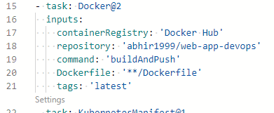

###### Release Pipelines

This pipeline is used to deploy the Docker images to the AKS cluster to keep up with 
CI/CD which are run when new code is pushed to the repository. This is done using
resource managers as it changes the resources in your resources group.

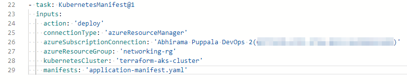

###### Release Pipelines

Tested functionality by changing code in the html code to see if pods will update when code
gets updated as required by CI/CD. I build the Docker Images and pushed them and then 
pushed the updated code the GitHub to update the deployments on the AKS cluster. Then used
port forwarding to access the website locally.

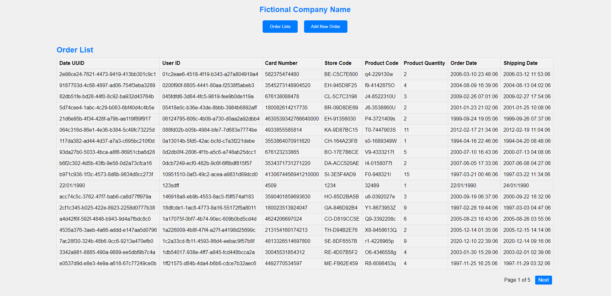

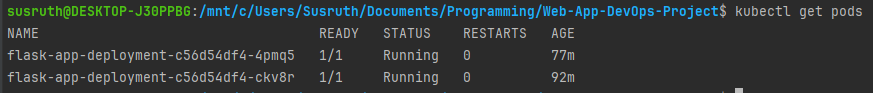

#### AKS Cluster Monitoring

##### Metric explorer

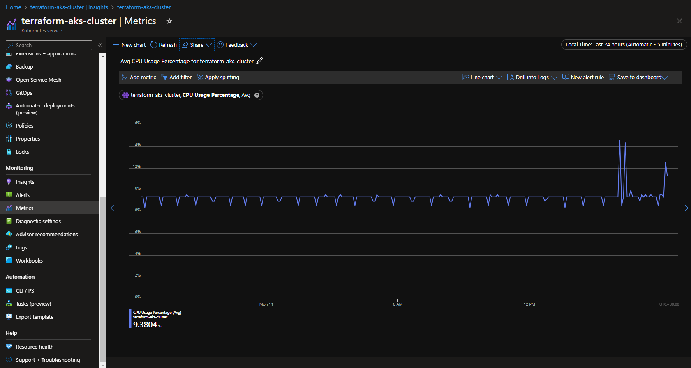

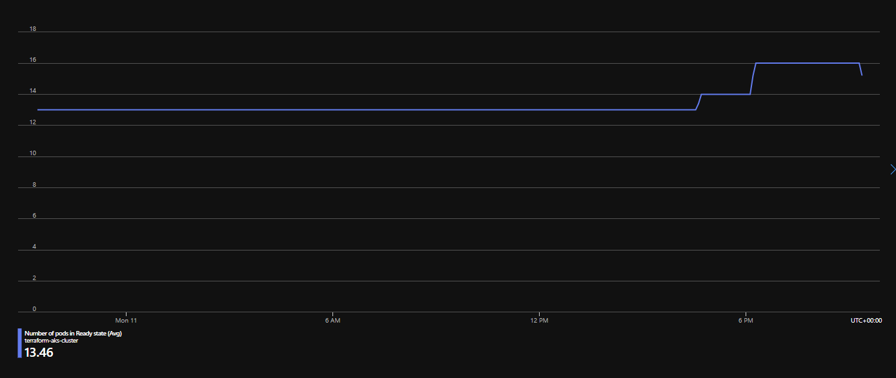

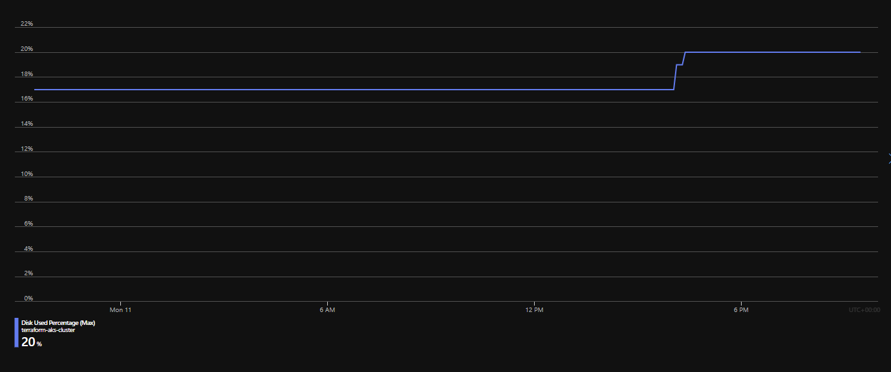

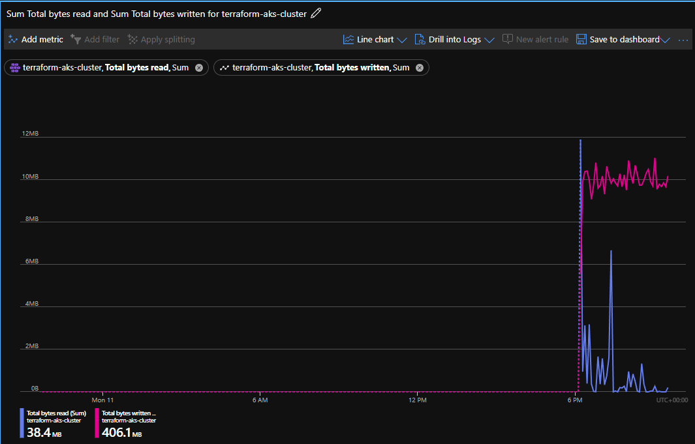

##### Log Analytics

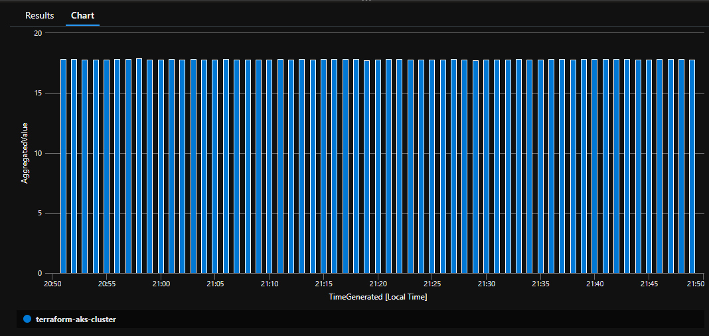

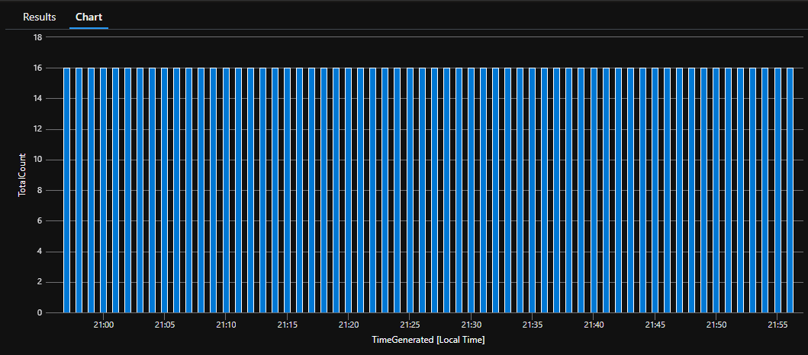

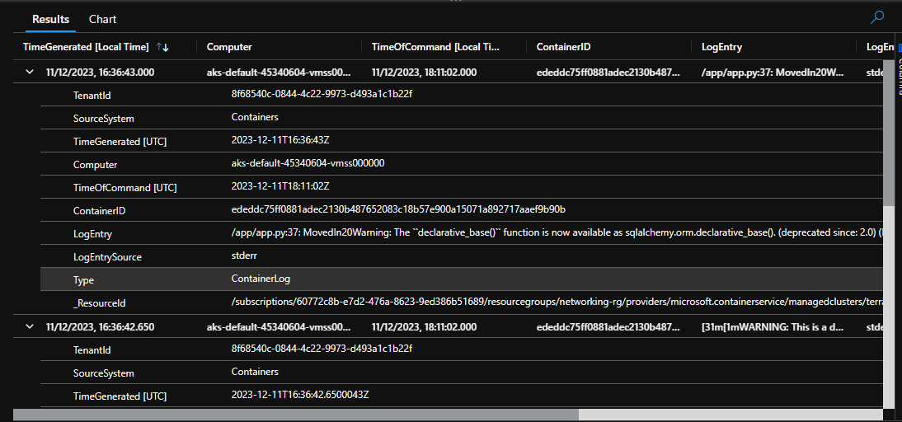

No events in Monitoring Kubernetes Events

##### Alarms and Alerts

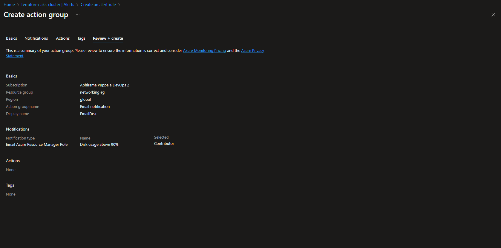
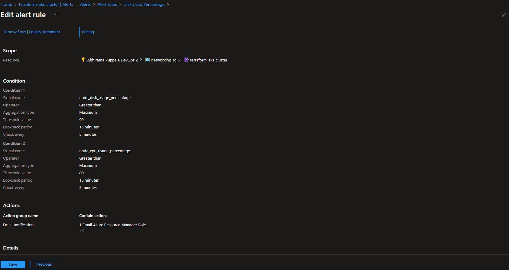

#### AKS Integration with Azure Key Vault for secrets management

Created a keyvault to secrets within the application to avoid having secrets in the project. I also added the access
to the key vault by adding a RBAC role to enable control of the vault to access the secrets. Then we create the secrets
which we will use in the code. I gave it Key Vault Administrator granting full control of the key vault to access
policies, configure advanced settings and perform any operation within the key vault.

##### Secrets stored in key vault

1. Server URL: Defines where the database is in the docker container to access and add data
2. Database Name: Provides the database name for the application to find the correct database within the server to 
access data
3. Username and Password: Access credentials to authenticate access to the database using the credentials defined 
above.

These secrets are used to create the connection string to allow the application access to the database.

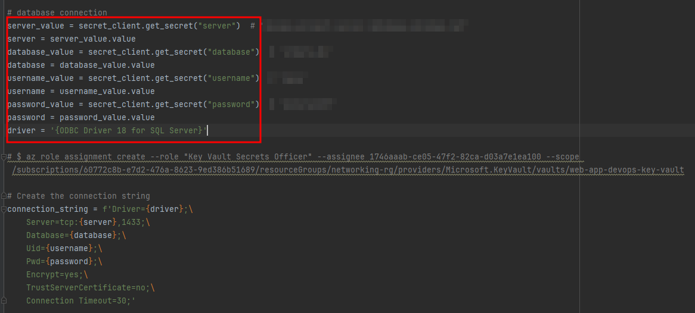

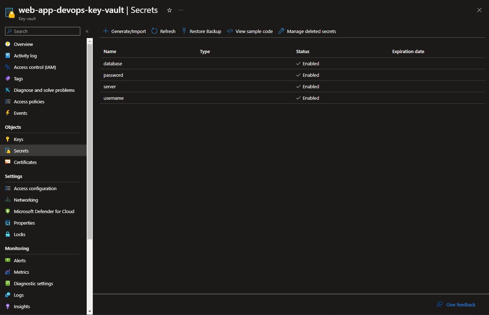

##### Overview of the system architecture

## Contributors 

- [Maya Iuga]([https://github.com/yourusername](https://github.com/maya-a-iuga))

## License

This project is licensed under the MIT License. For more details, refer to the [LICENSE](LICENSE) file.
